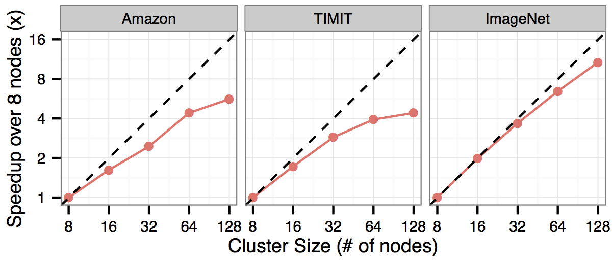

# Benchmarks

We have benchmarked KeystoneML against state-of-the-art performance achieved by other learning systems on a number of end-to-end benchmarks. In order to make these comparisons, we faithfully recreated learning pipelines as described by the benchmark authors, and run them on Amazon c2.4xlarge machines. The intent of these benchmarks is to show that <b>end-to-end applications</b> can be written and executed efficiently in KeystoneML.

Here we report the time taken by KeystoneML, the time taken by the competing systems, number of CPU cores (or number of GPUs) allocated to each system, total wall-clock speedup. By efficiently leveraging cluster resources, KeystoneML is able to run tasks an order of magnitude faster than highly specialized single-node systems. Meanwhile, on the TIMIT task, we're able to match state-of-the art performance (and nearly match the runtime) on an IBM BlueGene supercomputer using a fraction of the resources.

Each of the example pipelines below can be found in the KeystoneML <a href="https://github.com/amplab/keystone/tree/master/src/main/scala/pipelines">source code</a>.

<table class="tg">
  <tr>
    <th class="tg-hgcj">Dataset</th>
    <th class="tg-hgcj">KeystoneML Accuracy</th>
    <th class="tg-hgcj">Reported Accuracy</th>
    <th class="tg-hgcj">KeystoneML Time (m)</th>
    <th class="tg-hgcj">Reported Time (m)</th>
    <th class="tg-amwm">KeystoneML CPU Cores</th>
    <th class="tg-amwm">Reported  CPU Cores</th>
    <th class="tg-hgcj">Speedup  Over Reported</th>
  </tr>
  <tr>
    <td class="tg-031e">Amazon Reviews<a href="#amzn">1</a></td>
    <td class="tg-0ord">91.6%</td>
    <td class="tg-0ord">N/A</td>
    <td class="tg-0ord">3.3</td>
    <td class="tg-0ord">N/A</td>
    <td class="tg-lqy6">256</td>
    <td class="tg-lqy6">N/A</td>
    <td class="tg-0ord">N/A</td>
  </tr>
  <tr>
    <td class="tg-031e">TIMIT<a href="#timit">2</a></td>
    <td class="tg-0ord">66.1%</td>
    <td class="tg-0ord">66.3%</td>
    <td class="tg-0ord">138</td>
    <td class="tg-0ord">120</td>
    <td class="tg-lqy6">512</td>
    <td class="tg-lqy6">4096</td>
    <td class="tg-0ord">0.87x</td>
  </tr>
  <tr>
    <td class="tg-031e">ImageNet<a href="#imnet">3</a></td>
    <td class="tg-0ord">67.4%</td>
    <td class="tg-0ord">66.6%</td>
    <td class="tg-0ord">270</td>
    <td class="tg-0ord">5760</td>
    <td class="tg-lqy6">800</td>
    <td class="tg-lqy6">16</td>
    <td class="tg-0ord">21x</td>
  </tr>
  <tr>
    <td class="tg-031e">VOC<a href="#voc">4</a></td>
    <td class="tg-0ord">57.2%</td>
    <td class="tg-0ord">59.2%</td>
    <td class="tg-0ord">7</td>
    <td class="tg-0ord">87</td>
    <td class="tg-lqy6">256</td>
    <td class="tg-lqy6">16</td>
    <td class="tg-0ord">12x</td>
  </tr>
</table>
 
Additionally, we've tested KeystoneML for its scalability to clusters with hundreds of nodes and thousands of cores. Here, we show the speedup of three pipelines (Amazon Reviews, TIMIT, and ImageNet) over 8 nodes. Ideal speedup is shown with the dotted line. KeystoneML is able to achieve near linear speedup as we add more nodes because of its use of communication-avoiding algorithms during featurization and model training.

<hline>
1. C. Manning and D. Klein. Optimization, Maxent Models, and Conditional Estimation Without Magic. In HLT-NAACL 2003, Tutorial Volume 5. 
2. P.-S.Huang,H.Avron,T.N.Sainath,V.Sindhwani, and B. Ramabhadran. Kernel Methods Match Deep Neural Networks on TIMIT. In ICASSP, pages 205– 209. IEEE, 2014. 
3. J. Sanchez, F. Perronnin, T. Mensink, and J. Verbeek. Image Classification with the Fisher Vector: Theory and Practice. International Journal of Computer Vision, 105(3):222–245, 2013. 
4. K. Chatfield, V. Lempitsky, A. Vedaldi, and A. Zisserman. The Devil is in the Details: An Evaluation of Recent Feature Encoding Methods. In British Machine Vision Conference, 2011. 